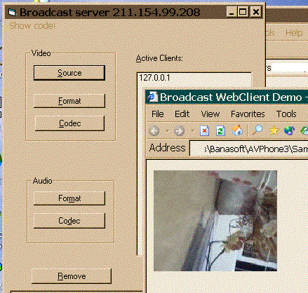



## \[ Broadcast your real time video and audio\! \]

### Description

Broadcast demo includes two applications, one is called "Cam". It broadcasts real time video and audio from a camera and sound device in "push" way. The clients can use the client side software or embeding OLE object in the browser to get the real time data. Video and audio data can be compressed to any format MPEG4, H263L, MP3 or G723 ...

The second one called "File", which broadcasts AVI files in "pull" way.
 
### More Info
 

             |
---                |---
**Submitted On**   |2002-12-15 21:41:04
**By**             |[Un1](https://github.com/Planet-Source-Code/PSCIndex/blob/master/ByAuthor/un1.md)
**Level**          |Intermediate
**User Rating**    |2.6 (26 globes from 10 users)
**Compatibility**  |VB 4\.0 \(32\-bit\), VB 5\.0, VB 6\.0, VB Script, ASP \(Active Server Pages\) , VBA MS Access, VBA MS Excel
**Category**       |[Graphics](https://github.com/Planet-Source-Code/PSCIndex/blob/master/ByCategory/graphics__1-46.md)
**World**          |[Visual Basic](https://github.com/Planet-Source-Code/PSCIndex/blob/master/ByWorld/visual-basic.md)
**Archive File**   |[\[\_Broadcas1537041302003\.zip](https://github.com/Planet-Source-Code/un1-broadcast-your-real-time-video-and-audio__1-42832/archive/master.zip)

